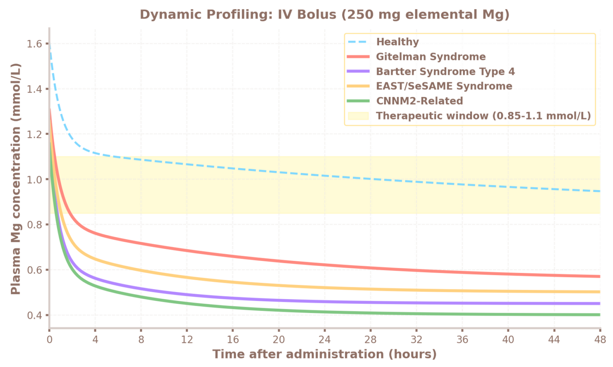
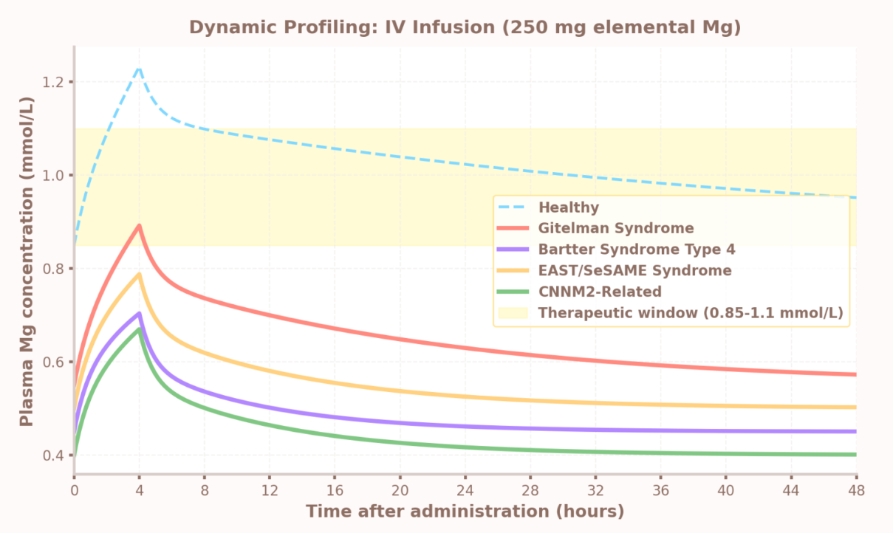
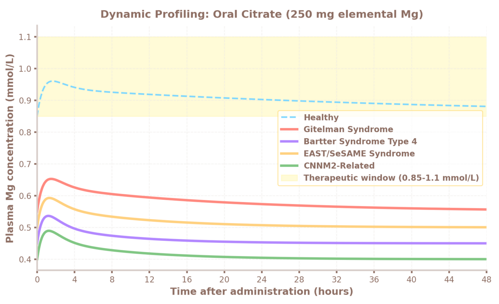
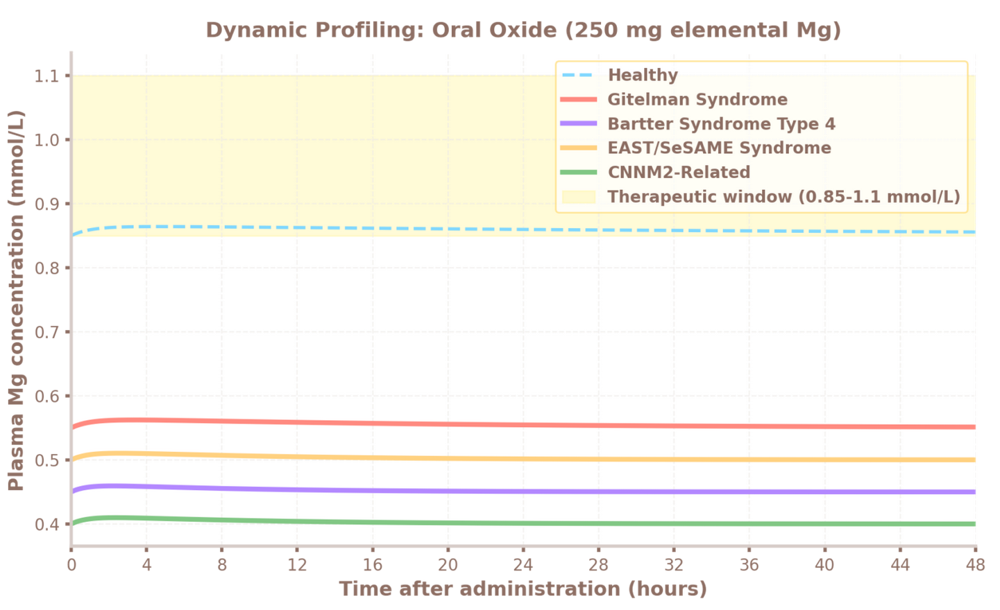

<div align="center">
  <h1>Magnesium pharmacokinetics simulator</h1>
  <p><i> 1C + 2C + population pharmacokinetics via monte carlo simulation dashboard</i></p>

[](https://www.python.org/)
[](https://streamlit.io/)
[](#)
[](#)
</div>

An interactive Python tool for simulating magnesium concentration-time profiles using one-compartment and two-compartment PK models with Monte Carlo population variability analysis.

This project combines systemic magnesium levels over time based on literature-derived pharmacokinetic parameters while accounting for endogenous baseline magnesium concentrations. It also has a fully interactive Streamlit dashboard with dedicated tabs for classical 1-compartment simulation, 2-compartment biphasic modeling, and Monte Carlo population analysis.

---

## Features

- **1-Compartment model** for IV bolus, IV infusion, oral magnesium citrate, and oral magnesium oxide
- **2-Compartment model** with configurable central/peripheral distribution and intercompartmental clearance
- **Monte Carlo population simulation** with inter-individual variability
- **Genetic Renal Wasting Analysis** for inherited tubulopathies affecting renal magnesium handling
- **Real-time parameter adjustment** through an interactive Streamlit dashboard
- **Automatic PK metric calculation** including Cmax, Tmax, and AUC
- **CLI runner** for reproducible simulations and figure generation

---

## Screenshots

### 1-Compartment Model

IV bolus, IV infusion, oral citrate, and oral oxide simulations with real-time parameter adjustment.

<p align="center">
  
</p>

### 2-Compartment Model

Biphasic alpha/beta kinetics with adjustable central volume (Vc), peripheral volume (Vp), and intercompartmental clearance (Q). Includes direct comparison with the 1-compartment model.

<p align="center">
  
</p>

### Monte Carlo Population Analysis

Population variability in body weight, half-life, volume of distribution, bioavailability, and absorption rate constants. Displays 5th, 50th, and 95th percentile concentration bands.

<p align="center">
  
</p>

### Genetic Renal Wasting Analysis

This section was added as a dedicated Streamlit dashboard tab for analyzing magnesium pharmacokinetics in inherited renal magnesium wasting disorders. It compares a healthy reference profile with Gitelman syndrome, Bartter syndrome type 4, EAST/SeSAME syndrome, and CNNM2-related renal magnesium wasting.

The model uses disease-specific baseline magnesium concentrations and renal wasting factors in a transparent 2-compartment simulation. It supports IV bolus, IV infusion, oral magnesium citrate, and oral magnesium oxide, so the user can compare how different routes affect peak concentration, therapeutic-window exposure, and return toward a pathological baseline.

Key assumptions in this tab:

- Disease-specific baseline plasma magnesium levels
- Increased renal magnesium elimination for each tubulopathy
- Route-specific absorption and bioavailability for oral citrate and oxide
- 48-hour concentration-time profiling
- Therapeutic window overlay at 0.85-1.10 mmol/L

#### Route comparison examples

<p align="center">
  
</p>

<p align="center">
  
</p>

<p align="center">
  
</p>

<p align="center">
  
</p>

### CLI Output

The standalone CLI runner generates publication-style comparison plots and prints PK metrics directly to the terminal.

<p align="center">
  
</p>

Cmax, Tmax, and AUC are automatically calculated for every simulated scenario.

```text
1C Model
IV Bolus Cmax=1.4378 Tmax=0.00 h AUC=57.85
IV Infusion Cmax=1.4109 Tmax=4.04 h AUC=57.45
Oral Citrate Cmax=0.8660 Tmax=8.27 h AUC=41.34

2C Model
IV Bolus Cmax=2.3194 Tmax=0.00 h AUC=57.83
IV Infusion Cmax=1.5858 Tmax=3.94 h AUC=57.44
Oral Citrate Cmax=0.9787 Tmax=1.64 h AUC=43.93
Oral Oxide Cmax=0.8665 Tmax=4.62 h AUC=41.34
```
---

## Requirements

Python 3.10+ and:

```bash
pip install numpy matplotlib streamlit
```

NumPy 2.0+ is required for `np.trapezoid`.

---

## How to run?

### Interactive dashboard (recommended)

```bash
streamlit run mg_pk_model/dashboard.py
```

### CLI Script

```bash
cd mg_pk_model
python main.py
```

Prints a complete 1C vs 2C metrics table and saves:

```text
pk_simulation_plot.png
```

---

## Key parameters

| Parameter | Default | Range (Dashboard) |
|------------|------------|------------|
| Body weight | 70 kg | 40–120 kg |
| Elimination t½ | 30 h | 10–50 h |
| Vd (1-compartment) | 0.50 L/kg | Fixed |
| Vc (2-compartment central) | 0.20 L/kg | 0.10–0.40 L/kg |
| Vp (2-compartment peripheral) | 0.30 L/kg | 0.10–0.60 L/kg |
| Q (intercompartmental) | 0.12 L/h/kg | 0.02–0.50 L/h/kg |
| IV dose | 500 mg | 100–1000 mg |
| IV infusion duration | 4 h | 0.5–12 h |
| Oral dose (citrate / oxide) | 300 mg | 100–1000 mg |
| Mg citrate bioavailability | 0.31 | 0.10–0.50 |
| Therapeutic window | 0.85–1.10 mmol/L | Fixed |
| Baseline plasma Mg | 0.85 mmol/L | Fixed |

### Genetic renal wasting defaults

| Condition | Baseline Mg | Renal wasting factor |
|------------|------------|------------|
| Healthy | 0.85 mmol/L | 1.0 |
| Gitelman syndrome | 0.55 mmol/L | 2.5 |
| Bartter syndrome type 4 | 0.45 mmol/L | 7.0 |
| EAST/SeSAME syndrome | 0.50 mmol/L | 5.0 |
| CNNM2-related renal wasting | 0.40 mmol/L | 6.0 |

---

## Disclaimer

This project is intended for educational, modeling, and research purposes only. It is not intended for clinical decision-making, patient treatment, or medical advice.
